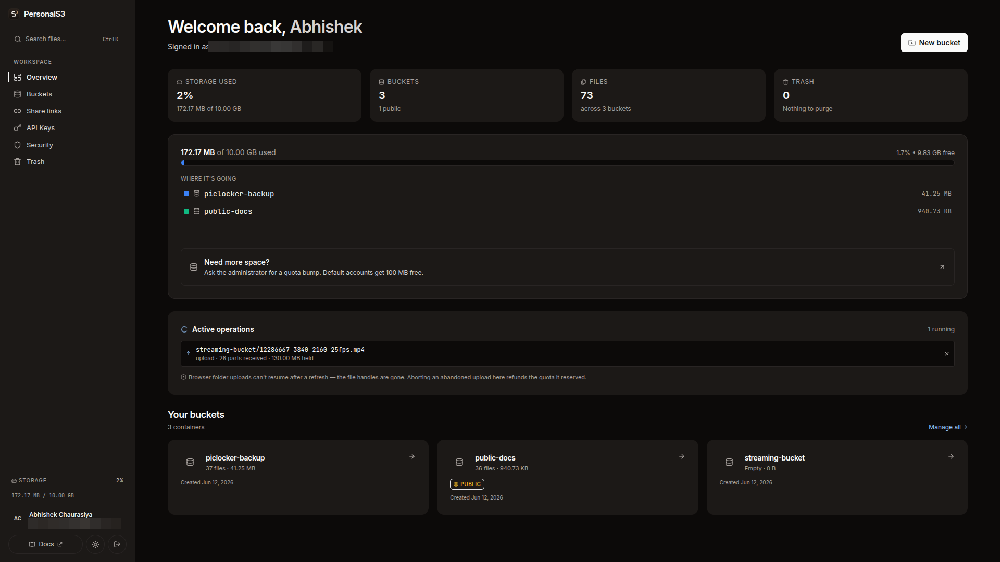
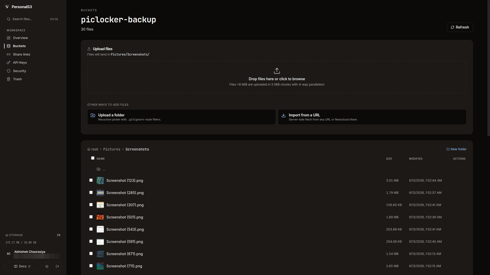

# PersonalS3

**Self-hosted, S3-compatible object storage with built-in media transcoding.**
Runs on your own hardware, globally accessible via Cloudflare Tunnel — no open ports, no cloud bill.

🌐 Live at [personals3.tech](https://personals3.tech) · 📚 [User docs](https://developers.personals3.tech) · ⌨️ [`ps3` CLI](https://github.com/personals3/cli)



---

## What it does

- **S3-compatible API** — works out of the box with `aws-cli`, `boto3`, and `rclone` via AWS SigV4. Buckets, objects, prefix listing, Range requests, multipart upload — with proper S3 XML responses for S3 clients.
- **Media transcoding pipeline** — upload a video and a background FFmpeg worker (with AMD/Intel VA-API hardware acceleration) transcodes it to an adaptive HLS ladder; audio gets HLS + MP3/OGG fallbacks, images get WebP/AVIF + thumbnails. Stream from any browser via share links.
- **Real multi-user system** — JWT + API-key auth with TOTP 2FA, per-user storage quotas enforced atomically (507 when exceeded, refunded on delete), Valkey-backed rate limiting, and an async audit log on every request.
- **Web dashboard** — Next.js UI for browsing buckets, drag-drop uploads with progress, sharing, trash, versioning, cross-bucket search, and a full admin panel.
- **`ps3` CLI** — cross-platform Go binary (`curl -fsSL https://personals3.tech/install | sh`) with `cp`, `sync`, `share`, `transcode`, shell completion.
- **Zero-exposure networking** — served through Cloudflare Tunnel; the host machine opens no inbound ports. PostgreSQL and Valkey bind to loopback only.
- **Self-healing storage** — a dedicated cleaner service verifies disk↔DB integrity with an adaptive Merkle-trie index + fsnotify watcher, and reaps orphaned files, expired trash, and abandoned multipart uploads.



## Architecture

```
                        ┌──────────────────────────────────────────┐
                        │              Cloudflare Tunnel           │
                        └──────────────────┬───────────────────────┘
                                           │
                              nginx  (single front door)
                  ┌────────────────────────┼─────────────────────┐
                  ▼                        ▼                     ▼
          Next.js dashboard          Go API (chi)        static HLS/images
          (web UI, admin)      buckets / objects / auth   (zero-copy sendfile)
                                     │        │
                          ┌──────────┘        └──────────┐
                          ▼                              ▼
                     PostgreSQL                       Valkey
               (metadata, users, audit,       (rate limits, cancel pub/sub)
                transcode job queue)
                          │  FOR UPDATE SKIP LOCKED
                          ▼
                  Python FFmpeg worker(s)
              (video → HLS ladder, audio, images)
```

**Stack:** Go (API + cleaner + CLI) · Python (transcoding worker) · Next.js (dashboard) · PostgreSQL · Valkey · Nginx · FFmpeg · Docker Compose · Cloudflare Tunnel

## Quick start

Prerequisites: Docker 20+ with Compose v2.

```bash
git clone https://github.com/personals3/server && cd server

# Generate secrets (interactive: asks for admin email + password)
./scripts/init-secrets.sh

# Bring everything up (first build ~2 min)
docker compose up -d --build

# Verify
docker compose ps
curl http://localhost:8080/api/healthz
```

Everything goes through nginx on port `8080` — the dashboard at `/`, the API under `/api/`. Open [http://localhost:8080](http://localhost:8080) and log in with the admin credentials you just created, or go straight to the API:

```bash
# Login → API key → upload
JWT=$(curl -s -X POST localhost:8080/api/auth/login \
  -H "Content-Type: application/json" \
  -d '{"email":"you@example.com","password":"..."}' | jq -r .token)

KEY=$(curl -s -X POST localhost:8080/api/auth/keys \
  -H "Authorization: Bearer $JWT" \
  -H "Content-Type: application/json" \
  -d '{"name":"my-laptop"}' | jq -r .key)

curl -X PUT localhost:8080/api/photos -H "Authorization: Bearer $KEY"
curl -X PUT localhost:8080/api/photos/beach.jpg \
  -H "Authorization: Bearer $KEY" --data-binary @beach.jpg
```

Or use your existing S3 tooling (create S3 credentials in the dashboard first):

```bash
aws s3 ls --endpoint-url http://localhost:8080/api --profile personals3
aws s3 sync ~/Pictures s3://photos/ --endpoint-url http://localhost:8080/api --profile personals3
```

See the [client cookbooks](https://developers.personals3.tech) for `boto3`, `rclone`, and multipart recipes.

## Design decisions worth reading

- **Quota enforcement is atomic.** Bytes are reserved against the user's quota in a single conditional `UPDATE ... WHERE used + delta <= quota`, so two concurrent uploads can't both squeeze past the limit. Transcodes pre-reserve an estimate at enqueue time and settle the actual delta at publish — closing the TOCTOU window between "check quota" and "write bytes".
- **Streaming never touches the API.** Transcoded HLS segments are served directly by nginx with zero-copy `sendfile()` and long cache headers, so Cloudflare's edge caches them globally and a popular video never loads the Go process.
- **Integrity verification scales adaptively.** The cleaner indexes object directories in a Merkle-style trie whose leaves split (IPv6-table style) when they exceed a threshold, so verification cost grows with churn, not total object count. An fsnotify watcher gives near-real-time orphan detection between full sweeps.
- **Background work is decoupled.** The FFmpeg worker and the cleaner are separate processes that coordinate purely through PostgreSQL (`SELECT ... FOR UPDATE SKIP LOCKED` job queue), so a crashed transcode never takes the API down, and workers scale horizontally with `--scale worker=N`.
- **Credentials are shown once.** API keys and S3 secret keys are stored hashed with a plaintext display prefix (`psk_xxxx…`), individually revocable, with optional expiry.

## Repository layout

```
api/          Go API server + cleaner service
worker/       Python FFmpeg transcoding worker
dashboard/    Next.js web UI + admin panel
db/           SQL migrations (auto-run on first startup)
nginx/        Front door: routing, static HLS serving
caddy/        Alternative TLS reverse proxy config
cloudflared/  Cloudflare Tunnel setup
scripts/      Secrets init, backup/restore, smoke tests
docs/         Architecture diagrams, API reference, design notebooks
```

The `ps3` CLI lives in its own repo: [personals3/cli](https://github.com/personals3/cli).

## Documentation

- **User guides** — [developers.personals3.tech](https://developers.personals3.tech): uploading (UI/CLI/API), streaming, quotas, sharing, troubleshooting
- **Architecture** — [docs/architecture/](./docs/architecture/): component diagrams + request data flows
- **Design notebooks** — [docs/come-up-designs/](./docs/come-up-designs/): how the cleaner evolved V1 (pure DB scan) → V4 (adaptive Merkle trie), with the rejected alternatives and scaling math
- **Original spec** — [plan-1.md](./plan-1.md)
- **Roadmap** — [FUTURE_PLANS.md](./FUTURE_PLANS.md)

## License

[MIT](./LICENSE)
